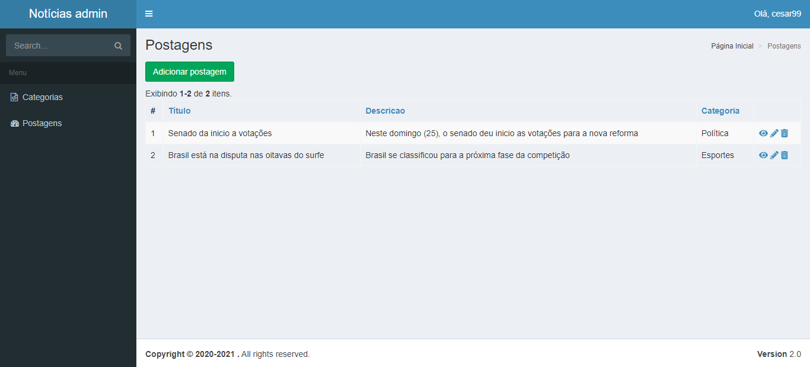
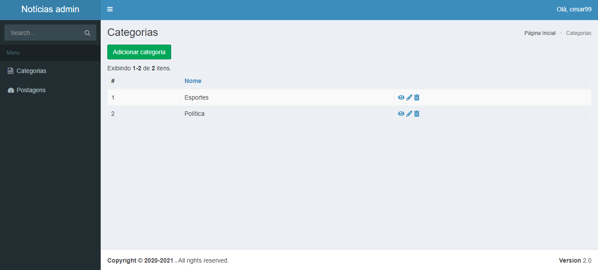
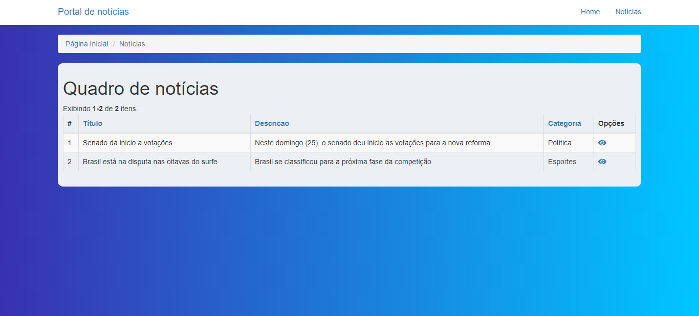
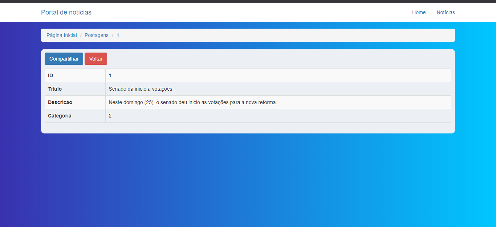

# Noticias
 
Projeto web de um site de notícias, com um módulo para os administradores fazerem o gerenciamento das postagens e demais informações, e módulo para o público vizualizar todas as postagens. 

<h3>Requisitos:</h3>
    <blockquote>
       Ter o composer instalado  
       Algum servidor (xampp, server do php ou algum de sua preferência)
    </blockquote>

<h3>Instalação: </h3>
<blockquote>
    clonar este repositório para um diretório de sua preferência e executar em um servidor.  
    O software conta com módulos: backend e frontend. Para utilizar no xampp ou semelhantes é necessário definir o virtual host para esses dois módulos, pode ser feito da segunda forma:  
</blockquote>
    <ul>
      <li>Navegar até o diretório <code>C:\xampp\apache\conf\extra</code></li>
      <li>Abrir o arquivo <code>httpd-vhosts.conf</code> e adicionar as seguintes informações: </li>  
    </ul>
    <blockquote>

        <VirtualHost *:80>
           ServerName noticias.localhost
            DocumentRoot "C:\xampp\htdocs\Noticias\frontend\web"

            <Directory "C:\xampp\htdocs\Noticias\frontend\web">
                # use mod_rewrite for pretty URL support
                RewriteEngine on
                # If a directory or a file exists, use the request directly
                RewriteCond %{REQUEST_FILENAME} !-f
                RewriteCond %{REQUEST_FILENAME} !-d
                # Otherwise forward the request to index.php
                RewriteRule . index.php

                # use index.php as index file
                DirectoryIndex index.php

                # ...other settings...
            </Directory>
        </VirtualHost>
       
        <VirtualHost *:80>
            ServerName noticias.localhost
            DocumentRoot "C:\xampp\htdocs\Noticias\backend\web"
            
            <Directory "C:\xampp\htdocs\Noticias\backend\web">
                # use mod_rewrite for pretty URL support
                RewriteEngine on
                # If a directory or a file exists, use the request directly
                RewriteCond %{REQUEST_FILENAME} !-f
                RewriteCond %{REQUEST_FILENAME} !-d
                # Otherwise forward the request to index.php
                RewriteRule . index.php

                # use index.php as index file
                DirectoryIndex index.php

                # ...other settings...
            </Directory>
        </VirtualHost>

   </blockquote>

   Feito isso, salve as alterações no arquivo <code> C:\xampp\apache\conf\extra </code> e reinicie o servidor.

<ul>
    <li>Para acessar o módulo do público digite no navegador: <code>noticias.localhost</code></li>
    <li>Para acessar o módulo do administrador digite no navegador: <code>dashnoticias.localhost</code>
    </li>
</ul>

<blockquote>
    Caso utilize o servidor embutido do php basta apenas navegar até <code>C:\xampp\htdocs\Noticias\frontend\web</code> <code>php -S localhost:8080</code> e <code>C:\xampp\htdocs\Noticias\backend\web</code> <code>php -S localhost:8081</code> 
</blockquote>

<blockquote>
    Após configurar a aplicação, entre no editor de código de sua preferência, e rode os seguintes comandos: 

  <li><code>php init</code> (A aplicação ira criar os arquivos de index nas pastas web dos dois módulos)</li>
    
  <li><code>php yii migrate</code> (A aplicação ira criar todas as tabelas necessárias para utilização)</li>
  OBS: Antes de rodar o comando das migrations, é necessário criar um banco de dados no seu mysql, e informar o nome do banco e demais informações do mysql no arquivo <code>Noticias\environments\dev\common\config\main-local.php</code>. Após fazer isso, é só rodar um <code>php init</code> novamente e a aplicação já estará funcionando.
<blockquote>

<h3>Imagens do módulo adm: </h3>

 
 

<h3>Imagens do módulo visitante: </h3>

 